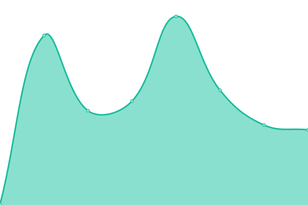
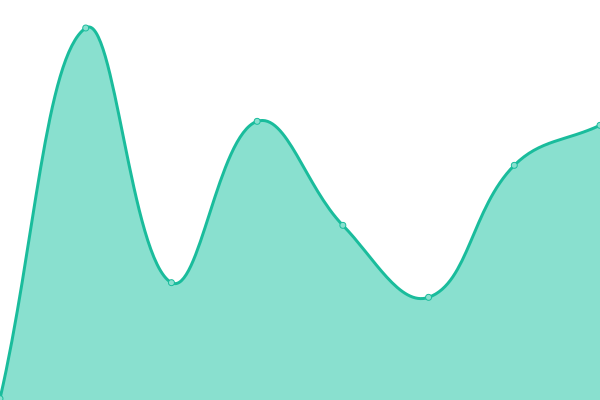
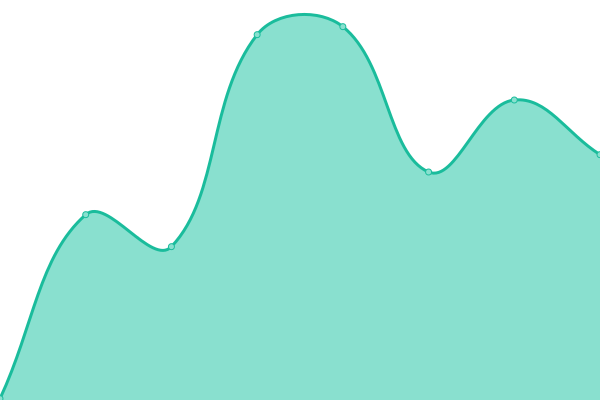

# [📈 Live Status](https://demo.upptime.js.org): <!--live status--> **🟧 Partial outage**

This repository contains the open-source uptime monitor and status page for [blackpirateapps](blackpiratex.com), powered by [Upptime](https://github.com/upptime/upptime).

With [Upptime](https://upptime.js.org), you can get your own unlimited and free uptime monitor and status page, powered entirely by a GitHub repository. We use [Issues](https://github.com/blackpirateapps/uptime/issues) as incident reports, [Actions](https://github.com/blackpirateapps/uptime/actions) as uptime monitors, and [Pages](https://demo.upptime.js.org) for the status page.

<!--start: status pages-->
<!-- This summary is generated by Upptime (https://github.com/upptime/upptime) -->
<!-- Do not edit this manually, your changes will be overwritten -->
<!-- prettier-ignore -->
| URL | Status | History | Response Time | Uptime |
| --- | ------ | ------- | ------------- | ------ |
|  [Blog By BlackPirateX](https://blog.blackpiratex.com) | 🟩 Up | [blog-by-black-pirate-x.yml](https://github.com/blackpirateapps/uptime/commits/HEAD/history/blog-by-black-pirate-x.yml) | 

 224ms
     
 | 

<a href="https://status.blackpiratex.com/history/blog-by-black-pirate-x">100.00%</a>
    

|  [BlackPirateX GitHub Mirror](https://mirror.blackpiratex.com) | 🟩 Up | [black-pirate-x-git-hub-mirror.yml](https://github.com/blackpirateapps/uptime/commits/HEAD/history/black-pirate-x-git-hub-mirror.yml) | 

 162ms
     
 | 

<a href="https://status.blackpiratex.com/history/black-pirate-x-git-hub-mirror">100.00%</a>
    

|  [BlackPirateX Cloudflare Mirror](https://mirror2.blackpiratex.com) | 🟥 Down | [black-pirate-x-cloudflare-mirror.yml](https://github.com/blackpirateapps/uptime/commits/HEAD/history/black-pirate-x-cloudflare-mirror.yml) | 

 172ms
     
 | 

<a href="https://status.blackpiratex.com/history/black-pirate-x-cloudflare-mirror">0.00%</a>
    

|  [BlackPirateX main website](https://blackpiratex.com) | 🟩 Up | [black-pirate-x-main-website.yml](https://github.com/blackpirateapps/uptime/commits/HEAD/history/black-pirate-x-main-website.yml) | 

 90ms
     
 | 

<a href="https://status.blackpiratex.com/history/black-pirate-x-main-website">100.00%</a>
    

|  [BlackPirateX Analytics](https://ant.blackpiratex.com) | 🟩 Up | [black-pirate-x-analytics.yml](https://github.com/blackpirateapps/uptime/commits/HEAD/history/black-pirate-x-analytics.yml) | 

 215ms
     
 | 

<a href="https://status.blackpiratex.com/history/black-pirate-x-analytics">100.00%</a>
    

|  [BlackPirate Status](https://status.blackpiratex.com) | 🟩 Up | [black-pirate-status.yml](https://github.com/blackpirateapps/uptime/commits/HEAD/history/black-pirate-status.yml) | 

 86ms
     
 | 

<a href="https://status.blackpiratex.com/history/black-pirate-status">100.00%</a>
    

<!--end: status pages-->

[**Visit our status website →**](https://demo.upptime.js.org)

## 📄 License

- Powered by: [Upptime](https://github.com/upptime/upptime)
- Code: [MIT](./LICENSE) © [blackpirateapps](blackpiratex.com)
- Data in the `./history` directory: [Open Database License](https://opendatacommons.org/licenses/odbl/1-0/)
